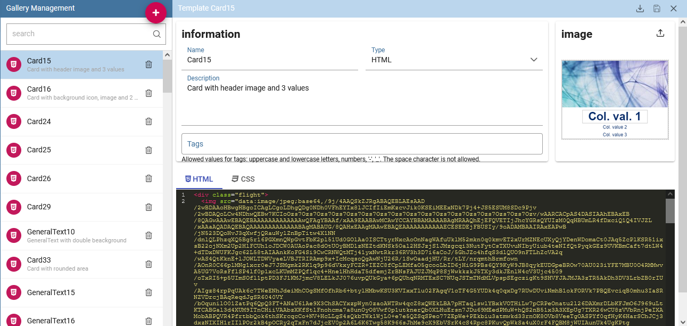
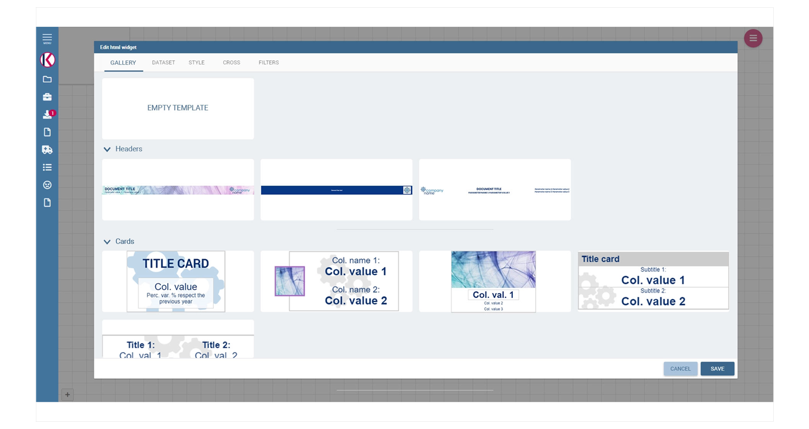

*Willing to take your data visualization to a higher level?*

This page collects KNOWAGE Gallery templates that helps you crafting **stunning visualizations of your data in few minutes**.


|  |             |
|:-------------:|:---------------:|
|    [](https://github.com/KnowageLabs/knowage-gallery-templates/tree/main/templates/card)  |    [](https://github.com/KnowageLabs/knowage-gallery-templates/tree/main/templates/header)   |


Gallery templates can be imported  into the Gallery management section *(pic. 1)* of KNOWAGE to provide end users with pre-built charts, labels and any kind of object with the only need to connect their own datasources.

Once imported, in fact, templates are easy to use: each HTML, R, PYTHON and CUSTOM widget has its own Gallery tab *(pic. 2)* in the widget edit mode from which choosing the most suitable template for the ongoing analysis.




### Contributions

*Willing to contribute sharing your top-level data visualization artworks?*

Read the following guideline and create your pull request: KNOWAGE Labs will review and add your template, giving you all credits and adding you to KNOWAGE .[contributors list!](https://www.knowage-suite.com/site/licensing/community-edition/)


*...but that's not all!*

* Stay up to date on the product and news from the world of business intelligence subscribing .[KNOWAGE monthly newsletter](https://www.knowage-suite.com/site/knowage-newsletter/)

* Take your place in the community around KNOWAGE on [Zanata portal](https://www.knowage-suite.com/zanata/) (KNOWAGE translation), [Github](https://github.com/KnowageLabs) (KNOWAGE source code) and [Q&A Forum](https://www.knowage-suite.com/qa/) (free support for KNOWAGE users)

* Improve your knowledge on KNOWAGE thanks to our [free webinars](https://www.knowage-suite.com/site/resources/knowage-webinars/) or the [online documentation](https://knowage-suite.readthedocs.io/)


### How to add templates

To add a new template to the list you can use **Knowage widget gallery** functionality or use your preferred editor to create a JSON template that will hold all the widget's informations.

Create a folder with the name of the widget you want to add and put it in a folder of the correct category, like:

``` /templates/card/my-custom-widget ```

Remember to add an image of the resulting widget in .jpg or .png format and a [MIT license file](https://github.com/git/git-scm.com/blob/main/MIT-LICENSE.txt) with your name, to keep the template copyright but allowing other community users to use it.

Than you will have to make a pull-request on [this repository](https://github.com/KnowageLabs/knowage-gallery-templates). If you don't know how to do it, just follow [this guideline](https://docs.github.com/en/desktop/contributing-and-collaborating-using-github-desktop/working-with-your-remote-repository-on-github-or-github-enterprise/creating-an-issue-or-pull-request)!

### License and support

The templates are provided by the open source community around KNOWAGE and validated by KNOWAGE Labs, only MIT license contributions will be accepted.

Templates can be used with any **KNOWAGE Community Edition** installation since version 7.4, in compliance with the constraints required by the chosen libraries.

In case of problems use the [issues tab](https://github.com/KnowageLabs/knowage-gallery-templates/issues) of the repository, to have support use the Knowage community [Q&A Forum](https://www.knowage-suite.com/qa/).